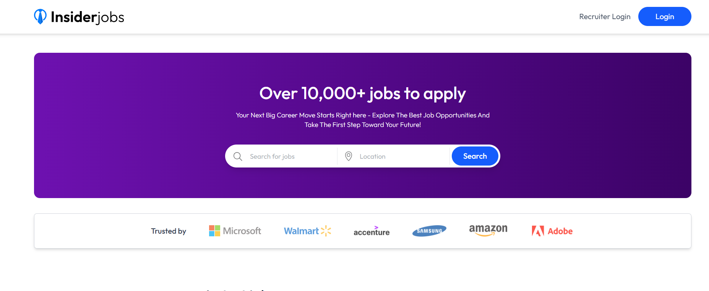
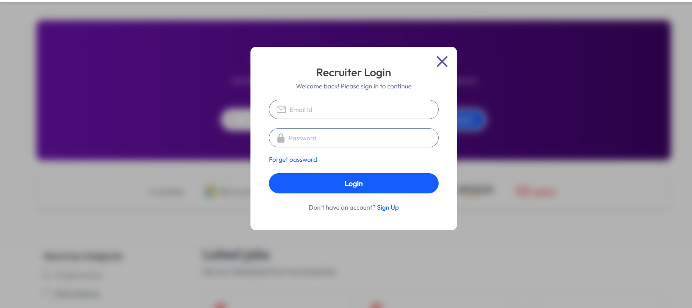
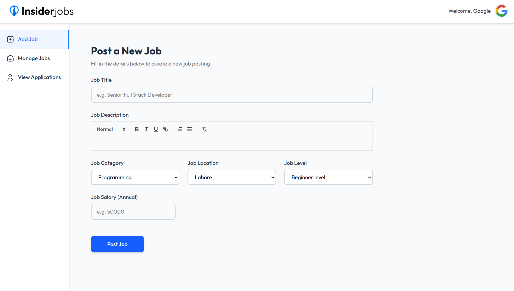
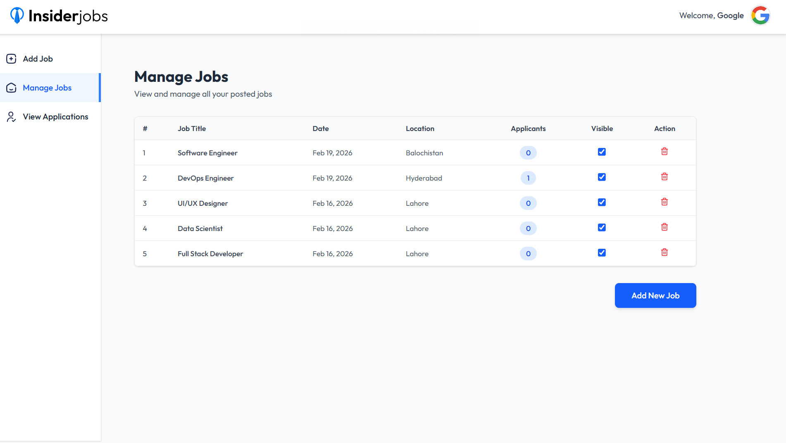
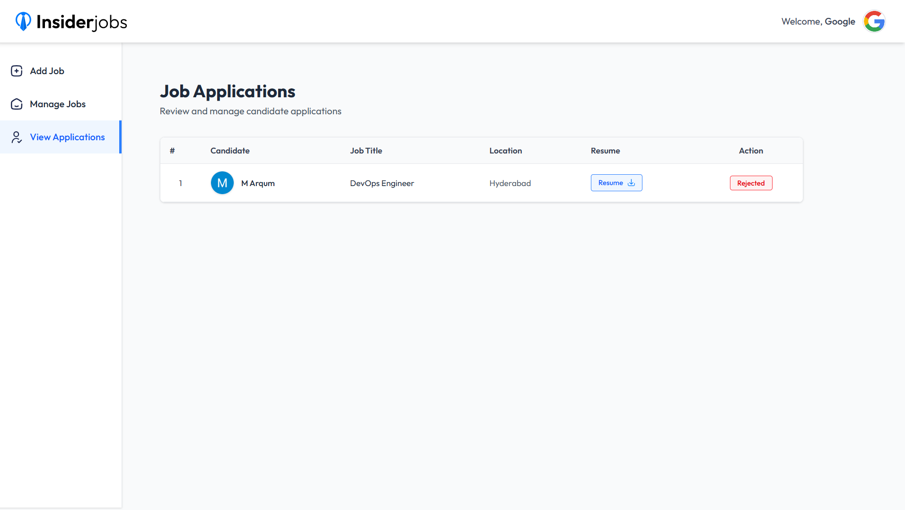

<!--
  SEO KEYWORDS: Innoze, Innoze Tech, Innoze Tech Solutions, InnozeTech,
  innoze github, innoze tech github, innoze tech solutions github, 
  MERN Job Portal, Full Stack Recruitment Platform, Job Board Pakistan,
  React Job Portal, Node.js Recruitment System, MongoDB Job Board, Online Hiring Platform,
  Job Posting Website, Recruitment Management System, HR Platform Pakistan,
  Full Stack Job Portal, MERN Stack Pakistan, Custom Recruitment Platform,
  Job Seeker Platform, Employer Dashboard, Innoze, Innoze Tech, Software House Pakistan,
  hiring-platform, job-board, recruitment-platform, fullstack-project
-->

<h1>💼 MERN Job Portal — Full Stack Recruitment Platform</h1>

A production-ready, full-stack <strong>Job Board & Recruitment Management System</strong> built by <strong><a href="https://github.com/innozetech">Innoze</a></strong> — connecting job seekers with employers through an intuitive platform for job postings, applications, and recruitment management.

---

## 🎯 The Problem

Businesses and job seekers both struggle with outdated recruitment processes:

- ❌ No centralized platform to post and manage job openings
- ❌ Applications received via email — unorganized and hard to track
- ❌ Job seekers have no way to monitor their application status
- ❌ HR teams waste hours manually reviewing and sorting candidates
- ❌ No analytics on job performance or applicant pipeline
- ❌ Poor mobile experience causing high drop-off rates

---

## ✅ Our Solution

**Innoze** engineered a two-sided recruitment platform — one side for **job seekers** to browse and apply, and one side for **recruiters** to post jobs, manage applicants, and track performance — all from a single, clean dashboard.

> A company can now run their entire hiring process digitally — from posting a job to accepting a candidate — without a single email or spreadsheet.

---

## 💼 Business Impact

| Before | After |
|:-------|:------|
| Jobs posted on random platforms | ✅ Centralized job board with full control |
| Applications managed via email | ✅ Organized applicant tracking dashboard |
| No real-time application status | ✅ Live status updates for job seekers |
| Manual candidate shortlisting | ✅ One-click accept/reject system |
| No recruitment analytics | ✅ Dashboard with job & applicant insights |
| Poor mobile experience | ✅ Fully responsive across all devices |

---

## ✨ Key Features

### 👥 Job Seeker Experience
- 🔐 Secure registration & login
- 🔍 Browse & filter jobs by location, category, level & salary
- 📄 One-click apply with resume upload
- 📊 Real-time application status tracking
- 📱 Fully responsive — mobile, tablet & desktop

### 🏢 Recruiter Control Panel
- 🔑 Dedicated company authentication portal
- 📝 Post jobs with rich text editor & detailed descriptions
- 🗂️ Manage all posted jobs from one place
- 👥 Review, accept or reject candidate applications
- 📈 Dashboard analytics — track job performance & applicants
- 🔒 Secure protected recruiter dashboard

---

## 🛠️ Tech Stack

| Layer | Technology |
|:------|:-----------|
| **Frontend** | React 18, Vite, Tailwind CSS, React Router |
| **Backend** | Node.js, Express.js |
| **Database** | MongoDB Atlas, Mongoose |
| **Auth** | Clerk Authentication, JWT, bcrypt |
| **File Uploads** | Cloudinary, Multer |
| **Deployment** | Vercel |

---

## 📸 Project Screenshots

### 🏠 Home Page

### 💼 Job Listings

### 📋 Applied Jobs

### 👤 User Login

### 🏢 Recruiter Login

### ➕ Post a Job (Recruiter)

### 🗂️ Manage Jobs (Recruiter)

### 👥 View Applications (Recruiter)

---

## 🌟 Why Innoze Built This

At **Innoze**, we solve real business problems through clean, scalable engineering. This recruitment platform was designed to eliminate the chaos of manual hiring — giving both job seekers and companies a **professional, efficient, and fully digital recruitment experience**.

> This project showcases our capability to build **multi-role, production-ready platforms** with real-world business logic, clean architecture, and modern UI/UX.

---

## 🤝 Want a Similar Solution for Your Business?

> Need a recruitment platform, job board, or any custom web application?
>
> **Innoze is here to build it, design it, and grow it with you.**

 

&nbsp;

---

  Built with ❤️ by <strong><a href="https://github.com/innozetech">Innoze</a></strong> — Karachi, Pakistan 🇵🇰

